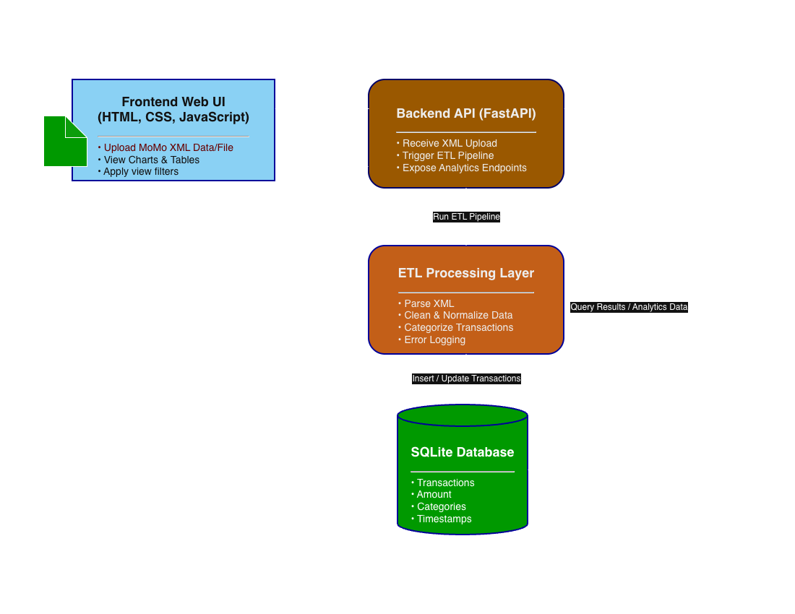

# MoMo SMS Data Processor

## Team Information

**Team Name:** HIT Enterprise Web Dev

**Project Description:**  
An enterprise-level fullstack application that processes Mobile Money (MoMo) SMS transaction data in XML format, cleans and categorizes the data, stores it in a relational database, and provides an interactive web dashboard for data analysis and visualization.

## Team Members

| Name | GitHub Username | Role |
|------|----------------|------|
| Ikenna Onugha | [@IkennaOnugha](https://github.com/IkennaOnugha) | Project Initiator |
| Helen Okereke | [@Helen751](https://github.com/Helen751) | Architecture Designer|
| Oladeji Toluwani | [@ToluwaniOladeji](https://github.com/ToluwaniOladeji) | Scrum Master |
---

## Project Links

- **System Architecture:** 


# https://viewer.diagrams.net/?tags=%7B%7D&lightbox=1&highlight=0000ff&edit=_blank&layers=1&nav=1&title=HIT-MoMo%20SMS%20Analytics.drawio&dark=auto#Uhttps%3A%2F%2Fdrive.google.com%2Fuc%3Fid%3D1mZt3cSCx2Y3F8TUrAiWjpK6ndlS66URa%26export%3Ddownload#%7B%22pageId%22%3A%22HOtfubfBUdEroN17rY5i%22%7D

- **Scrum Board:** 

---

## Project Structure

```
.
├── README.md                         # Setup, run, overview
├── .env.example                      # DATABASE_URL or path to SQLite
├── .gitignore                        # Git ignore rules
├── requirements.txt                  # Python dependencies
├── index.html                        # Dashboard entry (static)
├── docs/
│   └── architecture.png              # System architecture diagram
├── web/
│   ├── styles.css                    # Dashboard styling
│   ├── chart_handler.js              # Fetch + render charts/tables
│   └── assets/                       # Images/icons (optional)
├── data/
│   ├── raw/                          # Provided XML input (git-ignored)
│   │   └── momo.xml
│   ├── processed/                    # Cleaned/derived outputs for frontend
│   │   └── dashboard.json            # Aggregates the dashboard reads
│   ├── db.sqlite3                    # SQLite DB file
│   └── logs/
│       ├── etl.log                   # Structured ETL logs
│       └── dead_letter/              # Unparsed/ignored XML snippets
├── etl/
│   ├── __init__.py
│   ├── config.py                     # File paths, thresholds, categories
│   ├── parse_xml.py                  # XML parsing (ElementTree/lxml)
│   ├── clean_normalize.py            # Amounts, dates, phone normalization
│   ├── categorize.py                 # Simple rules for transaction types
│   ├── load_db.py                    # Create tables + upsert to SQLite
│   └── run.py                        # CLI: parse -> clean -> categorize -> load -> export JSON
├── api/                              # Optional (bonus)
│   ├── __init__.py
│   ├── app.py                        # Minimal FastAPI with /transactions, /analytics
│   ├── db.py                         # SQLite connection helpers
│   └── schemas.py                    # Pydantic response models
├── scripts/
│   ├── run_etl.sh                    # python etl/run.py --xml data/raw/momo.xml
│   ├── export_json.sh                # Rebuild data/processed/dashboard.json
│   └── serve_frontend.sh             # python -m http.server 8000 (or Flask static)
└── tests/
    ├── test_parse_xml.py             # Small unit tests
    ├── test_clean_normalize.py
    └── test_categorize.py
```

---

## Setup Instructions (Coming Soon)

### Prerequisites
- Python 3.8+
- Git
- Web Browser

### Installation
```bash
# Clone the repository
git clone https://github.com/[your-username]/[repo-name].git
cd [repo-name]

# Install dependencies
pip install -r requirements.txt

# Copy environment template
cp .env.example .env
```

### Running the Application
```bash
# Run ETL Pipeline
bash scripts/run_etl.sh

# Start Frontend Server
bash scripts/serve_frontend.sh
```

---

## Technologies Used

### Backend
- Python 3.8+
- lxml / ElementTree (XML Parsing)
- SQLite (Database)
- FastAPI (Optional API Layer)

### Frontend
- HTML5
- CSS3
- JavaScript (ES6+)
- Chart.js / D3.js (Data Visualization)

### Development Tools
- Git & GitHub

**Last Updated:** January 2026
