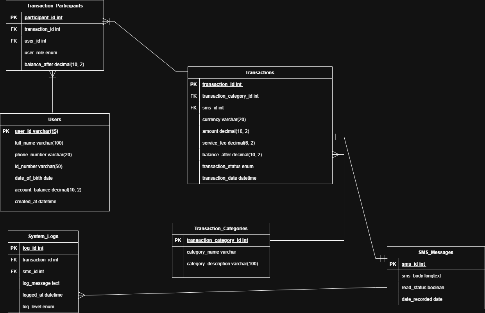

# MoMo SMS Data Processor

## Team Information

**Team Name:** HIT Enterprise Web Dev

**Project Description:**  
An enterprise-level fullstack application that processes Mobile Money (MoMo) SMS transaction data in XML format, cleans and categorizes the data, stores it in a relational database, and provides an interactive web dashboard for data analysis and visualization.

## Team Members

| Name | GitHub Username | Role |
|------|----------------|------|
| Ikenna Onugha | [@IkennaOnugha](https://github.com/IkennaOnugha) | Project Initiator |
| Helen Okereke | [@Helen751](https://github.com/Helen751) | Architecture Designer|
| Oladeji Toluwani | [@ToluwaniOladeji](https://github.com/ToluwaniOladeji) | Scrum Master |
---

## Project Links

- **System Architecture (Draw.io):** 


[View Project Architecture diagram here](https://viewer.diagrams.net/?tags=%7B%7D&lightbox=1&highlight=0000ff&edit=_blank&layers=1&nav=1&title=HIT-MoMo%20SMS%20Analytics.drawio&dark=auto#Uhttps%3A%2F%2Fdrive.google.com%2Fuc%3Fid%3D1mZt3cSCx2Y3F8TUrAiWjpK6ndlS66URa%26export%3Ddownload#%7B%22pageId%22%3A%22HOtfubfBUdEroN17rY5i%22%7D)

- **Scrum Board:** 

https://trello.com/invite/b/6964ec42a2764124d9b2113d/ATTI59609c82b8a1cea0c8fa31e266cf794f0E943E2B/momo-sms-analyzer-scrum-board


## Database Architecture
The system uses a MySQL 8.0 database named HIT_momo_analyzer.

Core Entities
Users: Stores KYC information (ID numbers, DOB, Balance).

transaction_categories: Stores a list of all accepted categories for transactions.

Transactions: The central ledger for sms analysis and financial operations.

Transaction_participants: A junction table managing roles (Sender/Receiver).

sms_messages: Stores the raw XML-formatted SMS strings.

system_logs: Tracks processing status and errors.

- **Full Database Schema and ERD Diagram:** 


## SQL to JSON Mapping Documentation
### Overview:
- This project maps a relational MySQL database into structured JSON responses suitable for API consumption. The mapping demonstrates how normalized tables are joined and serialized into meaningful, nested JSON objects.

### Table to JSON Mapping:
- The table below shows how each SQL table maps to its corresponding JSON representation used in API responses.

| SQL Table | Purpose in Database | JSON Representation | Notes |
|----------|--------------------|--------------------|-------|
| `users` | Stores user identity and account balance | `User` | Embedded inside transaction participants |
| `sms_messages` | Stores raw MoMo SMS content | `SmsMessage` | Nested under `transaction.sms_message` |
| `transaction_categories` | Defines transaction types | `TransactionCategory` | Nested under `transaction.transaction_category` |
| `transactions` | Core transaction records | `Transaction` | Nested under each participant |
| `transaction_participants` | Links users to transactions | `Complete_transaction_per_row` | Base table for compiled API response |
| `system_logs` | Tracks processing and errors | `SystemLog[]` | Returned as an array per transaction |

---

## JSON Serialization Strategy

- The **transaction_participants** table is used as the primary join point.
- SQL joins compile data from all related tables.
- Each row is serialized into a single, nested JSON object.
- This mirrors how real‑world APIs return joined relational data.

Example structure:
- Participant  
  → User  
  → Transaction  
    → Transaction Category  
    → SMS Message  
    → System Logs


## Notes

- Database constraints (FKs, checks, uniqueness) are enforced at the SQL level.
- Handling Relationships: > The Many-to-Many relationship in transaction_participants is converted from multiple database rows into a single JSON array of objects. This reduces the number of API calls needed to identify all parties involved in a transfer.


## CRUD OPERATIONS (DATABASE TEST)

### Inserting a new user to the users table (SUCCESS)


### Inserting a new transaction (SUCCESS)


### Read Operation: Viewing transactions with their categories sorted fron newest to oldest (SUCCESS)


### Update Operation: Updating the user's account balance (SUCCESS)


### Delete Operation: Deleting a transaction category referenced in transactions (RESTRICTED)


### Insert Operation (Key check: Inserting new transaction specifying a category that does not exist)


### Check Constraint: Inserting a negative value to the transaction amount column (FAILED)


### Trigger Test: Inserting a user under 16yrs old and testing the trigger error (FAILED)


## Project Structure

```
.
├── README.md                         # Setup, run, overview
├── .env.example                      # DATABASE_URL or path to MySQL
├── .gitignore                        # Git ignore rules
├── requirements.txt                  # Python dependencies
├── index.html                        # Dashboard entry (static)
├── database/
│   └── database_setup                # Database setup code (Create and insert seed)
├── docs/
│   └── architecture.png              # System architecture diagram
|   |── crud tests                    # all crud test images
|      └── crud_test0.png             #images used for test
├── web/
│   ├── styles.css                    # Dashboard styling
│   ├── chart_handler.js              # Fetch + render charts/tables
│   └── assets/                       # Images/icons (optional)
├── data/
│   ├── raw/                          # Provided XML input
│   │   └── momo.xml
│   ├── processed/                    # Cleaned/derived outputs for frontend
│   │   └── dashboard.json            # Aggregates the dashboard reads
│   ├── db.sqlite3                    # SQLite DB file
│   └── logs/
│       ├── etl.log                   # Structured ETL logs
│       └── dead_letter/              # Unparsed/ignored XML snippets
├── etl/
│   ├── __init__.py
│   ├── config.py                     # File paths, thresholds, categories
│   ├── parse_xml.py                  # XML parsing (ElementTree/lxml)
│   ├── clean_normalize.py            # Amounts, dates, phone normalization
│   ├── categorize.py                 # Simple rules for transaction types
│   ├── load_db.py                    # Create tables + upsert to SQLite
│   └── run.py                        # CLI: parse -> clean -> categorize -> load -> export JSON
├── api/                              # Optional (bonus)
│   ├── __init__.py
│   ├── app.py                        # Minimal FastAPI with /transactions, /analytics
│   ├── db.py                         # SQLite connection helpers
│   └── schemas.py                    # Pydantic response models
├── scripts/
│   ├── run_etl.sh                    # python etl/run.py --xml data/raw/momo.xml
│   ├── export_json.sh                # Rebuild data/processed/dashboard.json
│   └── serve_frontend.sh             # python -m http.server 8000 (or Flask static)
└── tests/
    ├── test_parse_xml.py             # Small unit tests
    ├── test_clean_normalize.py
    └── test_categorize.py

## Setup Instructions (Coming Soon)

### Prerequisites
- Python 3.8+
- Git
- Web Browser

### Installation
```bash
# Clone the repository
git clone https://github.com/IkennaOnugha/HIT_momo_analyzer.git
cd HIT_momo_analyzer

# Install dependencies
pip install -r requirements.txt

# Copy environment template
cp .env.example .env
```

### Running the Application
```bash
# Run ETL Pipeline
bash scripts/run_etl.sh

# Start Frontend Server
bash scripts/serve_frontend.sh
```

---

## Technologies Used

### Backend
- Python 3.8+
- lxml / ElementTree
- MySQL
- FastAPI 

### Frontend
- HTML5
- CSS3
- JavaScript (ES6+)
- Chart.js / D3.js

### Development Tools
- Git, GitHub and Trello(Project Management)

## AI Usage Log

**AI Tool Used:** ChatGPT

**Usage Summary:**
- Reviewing code syntax and quality assurance (syntax errors)
- Research on Mysql and cardinality best practices (Helped map resources, online articles and books that explains these concepts better.)
- used to debug errors thrown during sql query execution and correct command syntax
- Uniformity and grammer check on README

**Attribution:**  
AI assistance was used strictly as a support tool. All code logics, final decisions, schema designs, ERD and implementations were written, reviewed and approved by the HIT Team.

# MoMo Transaction API

A simple REST API for managing mobile money transactions.

## Setup

### 1. Prerequisites

- Python 3.6+

### 2. Installation

```bash
# Clone the repository
git clone https://github.com/yourusername/HIT_momo_analyzer.git
cd api
```

### 3. Run the Server

```bash
python api/app.py
```

Server will start on `http://localhost:8000`

## Usage

All endpoints require Basic Authentication:
- **Username:** `admin`
- **Password:** `Banana_boy`

### Get All Transactions

```bash
curl -u admin:Banana_boy http://localhost:8000/transactions
```

### Get Single Transaction

```bash
curl -u admin:Banana_boy http://localhost:8000/transactions/TXN001
```

### Create Transaction

```bash
curl -X POST http://localhost:8000/transactions \
  -u admin:Banana_boy \
  -H "Content-Type: application/json" \
  -d '{
    "id": "TXN1681",
    "transaction_id": "26811810649",
    "sender": "Alice",
    "receiver": "Bob",
    "amount": 5000.0,
    "currency": "RWF",
    "date": "02 Feb 2026",
    "type": "Payment",
    "body": "SMS Message"
  }'
```

### Update Transaction

```bash
curl -X PUT http://localhost:8000/transactions/TXN001 \
  -u admin:Banana_boy \
  -H "Content-Type: application/json" \
  -d '{"amount": 7000.0}'
```

### Delete Transaction

```bash
curl -X DELETE http://localhost:8000/transactions/TXN001 \
  -u admin:Banana_boy
```

## API Documentation

See [API_DOCS.md](docs/api_docs.md) for complete endpoint documentation.

## Notes

- Data is stored in `data/processed/transactions.json`
- Changes are in-memory only (not persisted to file)
- For production use, implement HTTPS and proper authentication
---

**Last Updated:** 2nd Febuary 2026.
